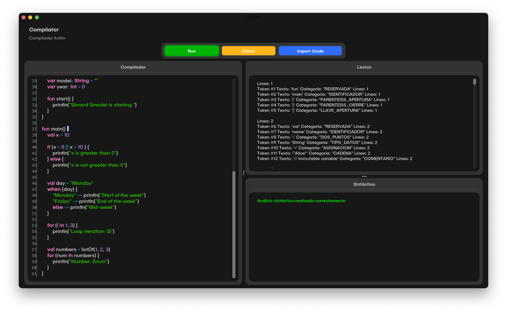

# Simulador de Compilador para Kotlin - Proyect
Este proyecto corresponde al proyecto final de la materia Tópicos Avanzados de Programación II, desarrollado en Java con el objetivo de construir un simulador de compilador para el lenguaje Kotlin.

El compilador implementa las fases de:
Análisis léxico: reconocimiento de tokens, identificadores, palabras reservadas, operadores y símbolos de Kotlin.
Análisis sintáctico: validación de la estructura gramatical según reglas definidas para el lenguaje.
De esta manera, el proyecto permite detectar errores léxicos y sintácticos en fragmentos de código escritos en Kotlin, simulando el proceso de compilación real.


## Tecnologías utilizadas
- IDE: IntelliJ IDEA
- Lenguaje: Java

Herramientas adicionales:
- JFlex → Generación del analizador léxico
- CUP → Generación del analizador sintáctico
- MigLayout → Sistema de layout flexible para la interfaz gráfica
- FlatLaf → Librería para un diseño moderno de la interfaz
- RSyntaxTextArea → Editor de texto con resaltado de sintaxis

## Instalación y ejecución
Clonar el repositorio
```groovy
git clone https://github.com/usuario/simulador-compilador-kotlin.git
```
cd simulador-compilador-kotlin
Abrir en IntelliJ IDEA
Importar el proyecto como Proyecto Maven/Gradle (dependiendo de la configuración).
Asegurarse de que el JDK 17 (o superior) esté configurado.
Generar analizadores
Ejecutar la clase Generador.java para compilar los archivos JFlex y CUP.
Ejecutar el simulador
Iniciar la clase principal del proyecto (Demo.java o la clase definida como launcher).


## Imagenes



